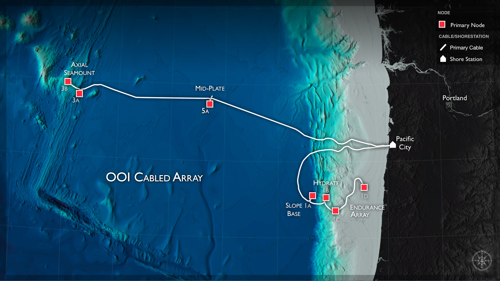
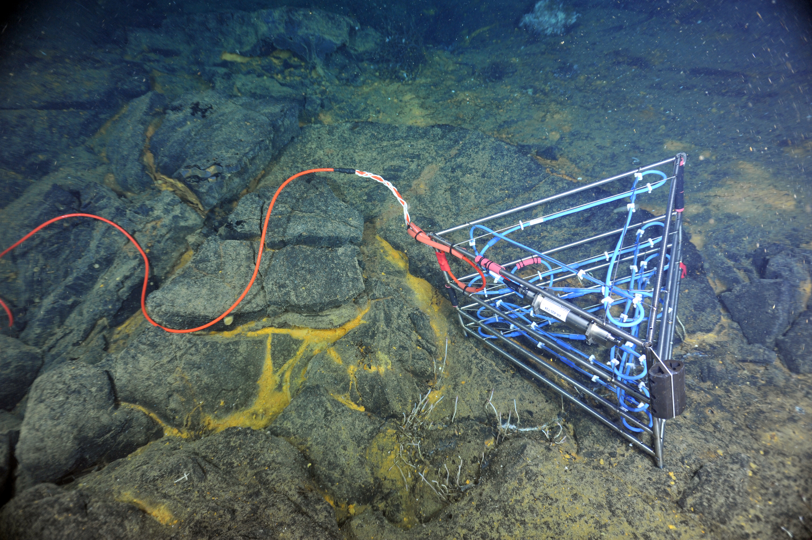
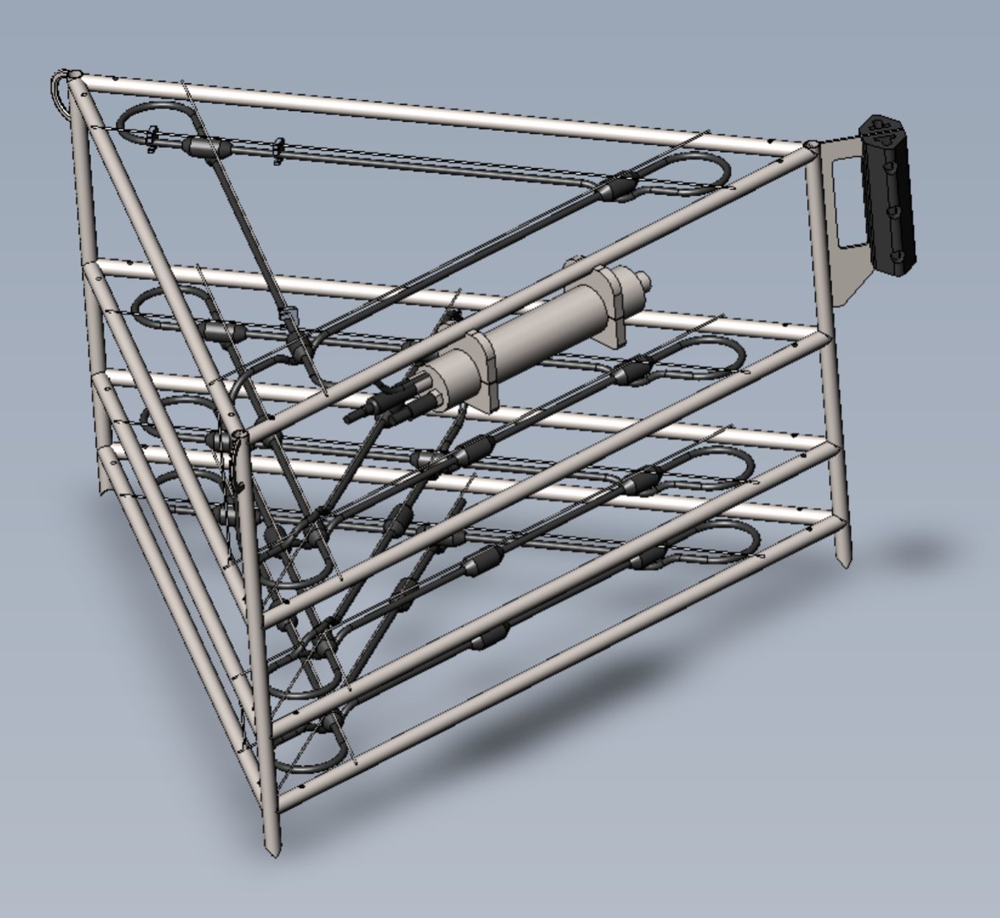
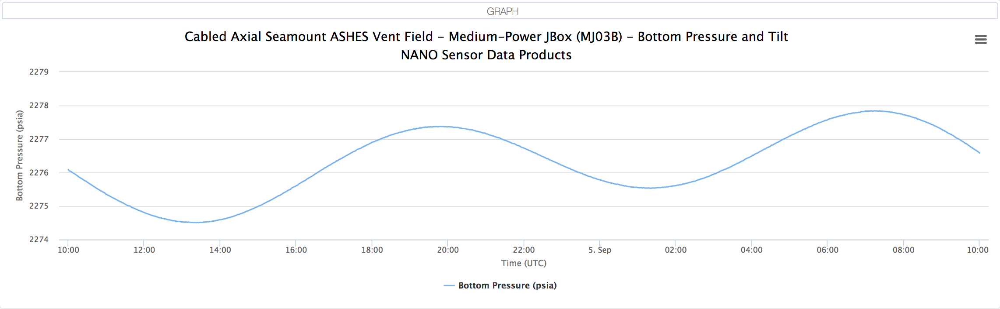
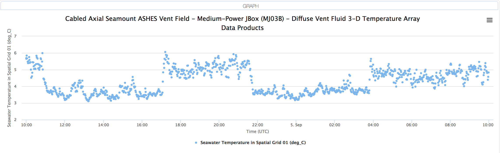
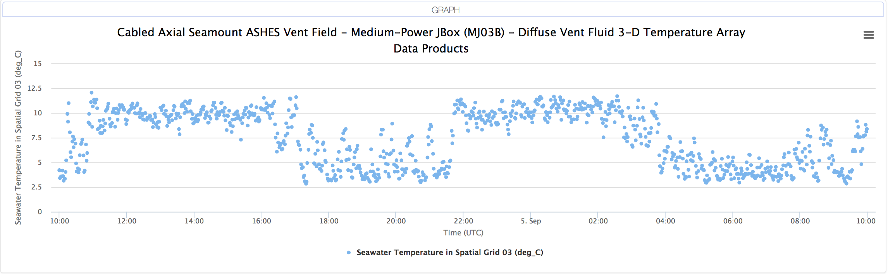

# 3D Thermistor Array

The OOI Cabled Array, maintained and operated by the University of Washington, is delivering real-time data from a [3D Thermistor Array](http://www.interactiveoceans.washington.edu/story/Thermistor_Array) deployed inside the caldera of [Axial Volcano](http://www.interactiveoceans.washington.edu/story/Axial_Caldera_PN3B_Fully_Installed). The 3D array consists of 24 temperature sensors at fixed [x, y and z positions](https://github.com/friedrichknuth/3D_Themistory_Array/blob/master/info/frame_geometry.pdf). A new measurement is made every ten seconds and data is available since 2014 up until present. The data can be retrieved in NetCDF or JSON formats. See examples under [scripts](https://github.com/friedrichknuth/3D_Themistory_Array/tree/master/scripts).

The goal is to interpolate and visualize the plume of hot water coming up from beneath the 3D Thermistor Array over time. This will help scientists understand if the tidal forcing mechanism is suppressing the plume into the subsurface or simply moving it back and forth above the seafloor with the rhythm of the tide.

The problem could be tackled in three stages:

* Produce a 3D visualization of the temperature plume at a given point in time and serve it up on [sketchfab](http://yt-project.org/doc/visualizing/sketchfab.html), for example.

* Produce an interactive 3D time lapse of the plume.

* Visualize the plume in realtime as the data streams ashore.

## Python tools

- [mplot3D](https://matplotlib.org/mpl_toolkits/mplot3d/tutorial.html) - 3D plotting

- [bokeh](https://demo.bokehplots.com/apps/surface3d) - 3D animated surface plots

- [plotly](https://plot.ly/python/3d-surface-plots/) - 3D surface plots

- [Dash](https://plot.ly/dash/) - web ready real-time plotting

## Other Resources

- [Paraview](https://www.paraview.org/) -  powerful package for plotting in 3D.

- [ytini](http://www.ytini.com/) - which is [yt](http://yt-project.org/doc/index.html) + [houdini](https://www.sidefx.com/).

- [Hardware Accelerated Volume Rendering](http://paulbourke.net/miscellaneous/glvol/) - Volume randering using OpenGL

## Initial Observations

From quick look plots in the UI, found [here](https://ooinet.oceanobservatories.org/data_access/#RS03ASHS-MJ03B-07-TMPSFA301/streamed_tmpsf-sample).

### Time Range: 2017/09/04 10:00 to 2017/09/05 10:00

### Bottom Pressure

### Thermistor 1

### Thermistor 3

### Observations

- temperature changes are abrupt
- the hottest thermistor (3) behaves opposite to other thermistors measuring warm diffuse flow (1)
- the system is controlled by tides